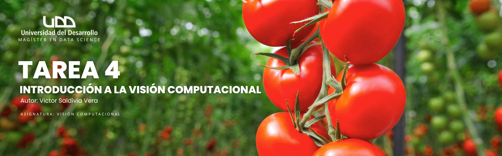

   
   
   
   

## 🌿 **Tarea 4: Comparativa de algoritmos para clasificación de hojas de tomate**

Este repositorio contiene el desarrollo de la **Tarea 4** de la asignatura *Visión Computacional*, en la que se mejora y compara el sistema de clasificación de hojas de tomate (sanas vs. Early Blight) implementado en la Tarea 2. Aquí se han añadido dos nuevas estrategias: transferencia de aprendizaje con MobileNetV2 y un clasificador SVM sobre features extraídas de la CNN base.

### 🧪 **Descripción del trabajo**

- **Dataset:**  
  PlantVillage (2 clases: `Tomato_Early-blight`, `Tomato_Healthy`).  
- **Imágenes utilizadas:**  
  200 imágenes preprocesadas (100 por clase), tamaño 128×128 px, RGB.  
- **Modelos implementados:**  
  1. **CNN base:** red convolucional desde cero con 3 bloques Conv2D+BatchNorm+ReLU+MaxPooling, seguido de Flatten, Dense(256) y Dropout(0.5).  
  2. **Transfer Learning (MobileNetV2):** backbone preentrenado en ImageNet, GlobalAveragePooling, Dense(128)+Dropout(0.5) y softmax.  
  3. **SVM sobre features:** extracción de embeddings (Flatten) de la CNN base y entrenamiento de un SVM (kernel RBF).  
- **Preprocesamiento y Data Augmentation:**  
  - Reescalado de píxeles a [0,1]  
  - Rotaciones (±30°), desplazamientos (±10%), shear (±10%), zoom (±20%), flip horizontal  
- **Evaluación:**  
  - **Métricas:** Accuracy, Precision, Recall, F1-score (macro)
  - **Matrices de confusión** (absoluta y normalizada)  
  - **Tiempos medidos:**  
    - Entrenamiento (segundos)  
    - Inferencia completa (segundos)  

### 📊 **Resultados destacados**

| Modelo                   | Accuracy | Precision (macro) | Recall (macro) | F1-score (macro) | Entrenamiento (s) | Inferencia (s) |
|--------------------------|:--------:|:-----------------:|:--------------:|:----------------:|:-----------------:|:--------------:|
| **CNN base**             | 50.00 %  | N/A               | N/A            | N/A              | 162.79            | 0.7473         |
| **Transfer Learning**    | 97.37 %  | N/A               | N/A            | N/A              | 92.57             | 1.9241         |
| **SVM sobre features**   | 50.00 %  | 25.00 %           | 50.00 %        | 33.33 %          | N/A               | N/A            |

> **Nota:**  
> - Los valores de “N/A” indican métricas que no se calcularon directamente en esta ejecución.  
> - Accuracy y tiempos provienen de los historiales de entrenamiento e inferencia mostrados en el notebook.

### 📈 **Visualizaciones incluidas**

- Curvas de entrenamiento y validación (loss & accuracy) para cada modelo  
- Matrices de confusión absoluta y normalizada  
- Histogramas de probabilidades predichas por clase  
- Ejemplos de imágenes clasificadas (aciertos y errores)  

### ⚠️ **Requisitos**

- Python 3.10+  
- TensorFlow / Keras  
- scikit-learn  
- matplotlib  
- pandas  
- Jupyter Notebook  

## 📄 Licencia

Este trabajo es de carácter académico y su uso está restringido exclusivamente para fines educativos.

El dataset utilizado proviene del [PlantVillage Dataset](https://github.com/spMohanty/PlantVillage-Dataset) (Hughes & Salathé, 2015).  
Por favor cite el artículo correspondiente si reutiliza este dataset:

> Hughes, D. P., & Salathé, M. (2015). An open access repository of images on plant health to enable the development of mobile disease diagnostics. *arXiv preprint arXiv:1511.08060*.  
